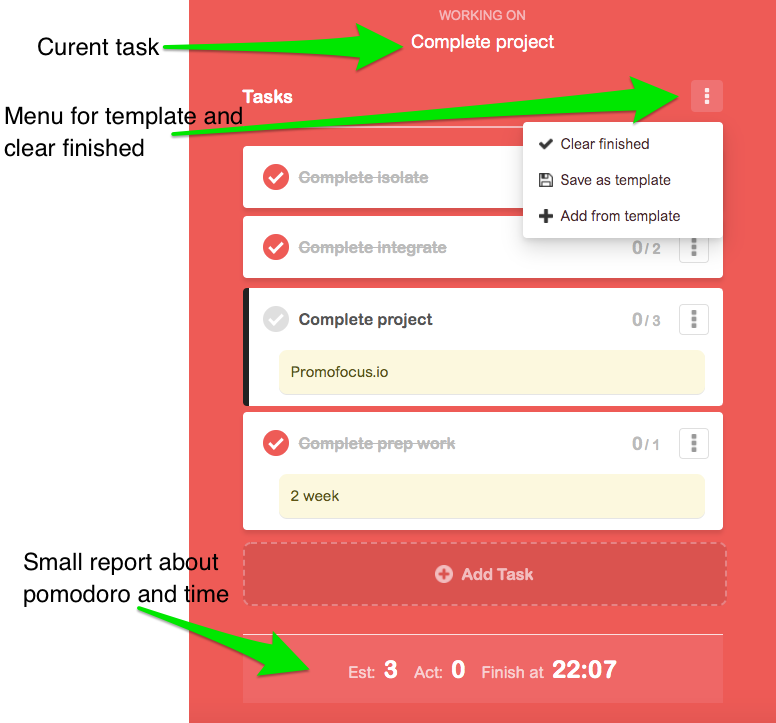

# JavaScript Promofocus

> About the project see [Readme.md](README.md)
---

## WIREFRAME

   
   
   

## 1. Initialize Application

__As a user I want to see the initial page when I load the site__
*Assigned to __________*
*Developed on branch `initialize-application`*

HTML, CSS for main page. 

---

## 2. Set timer

__As a user I would like be able to set the time to study base on promodo technique and set a time for long break and short break__
*Assigned to __________*
*Developed on branch `set-timer`*

Implement three timers. 

---

## 3. Progress bar

__As a user I would like watch the progress of duration my work or break pomodoro__
*Assigned to __________*
*Developed on branch `progress-bar`*

Add progress bar and link it to timers. 

---

## 4. Task manager

__As a user I would like be able add tasks, assign for each its own number of pomodoros and save it on screen__
*Assigned to __________*
*Developed on branch `task-manager`*

Add task-manager.

---

## 5. Template-menu

__As a user I would like be able create template from the exist task, use this template after, and clear all finished tasks with one click__
*Assigned to __________*
*Developed on branch `template-menu`*

Add template-menu. 

---

## 6. Report-panel

__As a user I would like to see how many pomidoros I'll plane, how many pomidoros complete and calculating the end time of tasks__
*Assigned to __________*
*Developed on branch `report-panel`*

Add report-panel. 

---